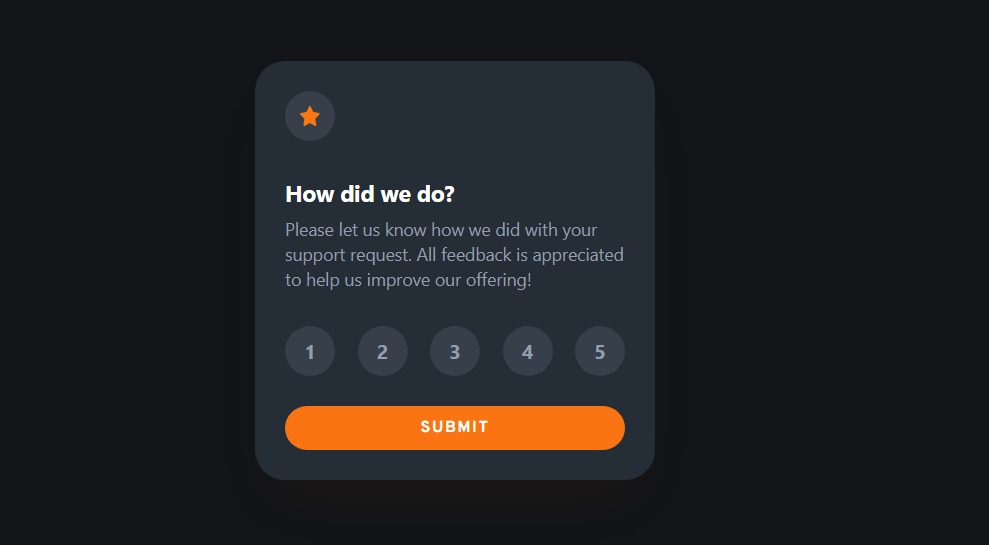

# Frontend Mentor - Interactive rating component solution

This is a solution to the [Interactive rating component challenge on Frontend Mentor](https://www.frontendmentor.io/challenges/interactive-rating-component-koxpeBUmI). Frontend Mentor challenges help you improve your coding skills by building realistic projects.

## Table of contents

-   [Frontend Mentor - Interactive rating component solution](#frontend-mentor---interactive-rating-component-solution)
    -   [Table of contents](#table-of-contents)
    -   [Overview](#overview)
        -   [The challenge](#the-challenge)
        -   [Screenshot](#screenshot)
        -   [Links](#links)
    -   [My process](#my-process)
        -   [Built with](#built-with)
        -   [What I learned](#what-i-learned)
        -   [Useful resources](#useful-resources)
    -   [Author](#author)

## Overview

### The challenge

Users should be able to:

-   View the optimal layout for the app depending on their device's screen size
-   See hover states for all interactive elements on the page
-   Select and submit a number rating
-   See the "Thank you" card state after submitting a rating

### Screenshot

### Links

-   Solution URL: [https://www.frontendmentor.io/solutions/interactive-rating-component-with-html-tailwind-css-and-vite-uxHc6XIJcf](https://www.frontendmentor.io/solutions/interactive-rating-component-with-html-tailwind-css-and-vite-uxHc6XIJcf)
-   Live Site URL: [https://interactive-rating-component-ndc.netlify.app/](https://interactive-rating-component-ndc.netlify.app/)

## My process

### Built with

-   Semantic HTML5 markup
-   [TailwindCSS](https://tailwindcss.com/) - A utility-first CSS framework
-   Flexbox
-   Grid
-   Mobile-first workflow
-   [Vite](https://vitejs.dev/) - Next generation frontend tooling

### What I learned

I'm particularly proud of how I used radio buttons to track the selected rating instead of implementing some complex state management and a lot of DOM manipulations. At first I was thinking of bringing a lightweight DOM library like [AlpineJS](https://alpinejs.dev/), but then I remembered that forms can track state and went for a simple solution.

### Useful resources

There's a Stack Overflow thread I used to help me style a label based on the state of the radio input button it's linked to. You can check out the thread [here.](https://stackoverflow.com/questions/4641752/css-how-to-style-a-selected-radio-buttons-label)

## Author

-   Frontend Mentor - [@chiroro-jr](https://www.frontendmentor.io/profile/chiroro_jr)
-   Twitter - [@chiroro_jr](https://www.twitter.com/chiroro_jr)
